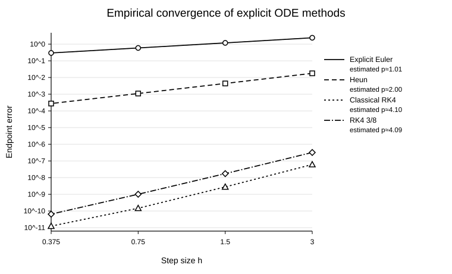
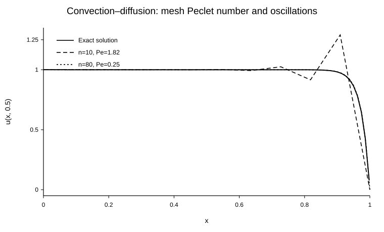
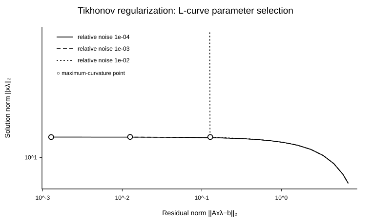

# Numerical Methods & Scientific Computing

MATLAB implementations and numerical experiments for **ordinary differential equations, convection-diffusion PDEs, and ill-conditioned inverse problems**. The emphasis is on convergence, stability, mesh dependence, conditioning, sparse discretization, and regularization.

## Highlights

- Explicit Euler, Heun, classical RK4, and RK4 3/8 implemented from scratch.
- Empirical convergence studies against a high-accuracy numerical reference.
- Absolute-stability regions for explicit time-stepping methods.
- Sparse centered finite-difference discretization of a 2-D convection-diffusion operator.
- Numerical illustration of mesh-Peclet effects and transport-dominated oscillations.
- SVD-based Tikhonov regularization for an ill-conditioned inverse problem.
- L-curve parameter selection using geometric curvature in log-log coordinates.

## Representative numerical results

### ODE convergence

The endpoint-error study recovers the expected first-, second-, and fourth-order behavior of the implemented schemes.



The test problem is the nonlinear IVP

```math
\theta'(t)=k_r\bigl(\theta(t)^4-\gamma\bigr),
\qquad
\theta(0)=1200.
```

with a high-accuracy `ode113` computation used as a **numerical reference**, not as an analytic solution.

### Convection-diffusion and the mesh Peclet number

The PDE module solves

```math
-\Delta u + \alpha\,u_x = f
```

on a rectangular domain with Dirichlet data. The discretization uses centered finite differences and assembles a sparse linear system. For unit diffusion coefficient,

```math
\mathrm{Pe}=\frac{|\alpha|h_x}{2}.
```

For the demonstration with `alpha = 40`, the coarse mesh (`n = 10`) has `Pe ≈ 1.82` and develops the characteristic non-physical overshoot of a transport-dominated centered scheme. Refining to `n = 80` gives `Pe ≈ 0.25` and removes the oscillation.



### Tikhonov regularization and the L-curve

The inverse-problem module constructs a matrix with exponentially decaying singular values and perturbs exact data with controlled relative Gaussian noise. It computes zero-order Tikhonov solutions

```math
x_\lambda
=\arg\min_x
\left(\lVert Ax-b\rVert_2^2+\lambda\lVert x\rVert_2^2\right)
```

through the SVD of `A`. The regularization parameter is selected from the geometric curvature of

```math
\left(
\log\lVert Ax_\lambda-b\rVert_2,
\log\lVert x_\lambda\rVert_2
\right).
```



## Repository structure

```text
.
├── ode/
│   ├── solvers/
│   │   ├── explicit_euler.m
│   │   ├── heun.m
│   │   ├── rk4_classical.m
│   │   └── rk4_38.m
│   ├── convergence_study.m
│   └── stability_regions.m
├── pde/
│   ├── convection_diffusion_2d.m
│   └── run_convection_diffusion_demo.m
├── inverse_problems/
│   ├── tikhonov_path.m
│   ├── lcurve_curvature.m
│   └── run_lcurve_experiment.m
└── figures/
```

## Running the experiments

Clone the repository, open MATLAB in the repository directory, and run any experiment script:

```matlab
run('ode/convergence_study.m')
run('ode/stability_regions.m')
run('pde/run_convection_diffusion_demo.m')
run('inverse_problems/run_lcurve_experiment.m')
```

The implementation uses standard MATLAB functionality only.

## Numerical topics

The project covers implementation of one-step ODE solvers, empirical order-of-accuracy studies, absolute stability, sparse finite-difference discretization, the mesh Peclet number, singular-value decay and ill-conditioning, Tikhonov filter factors, and L-curve parameter selection.

## License

MIT License. See [`LICENSE`](LICENSE).
